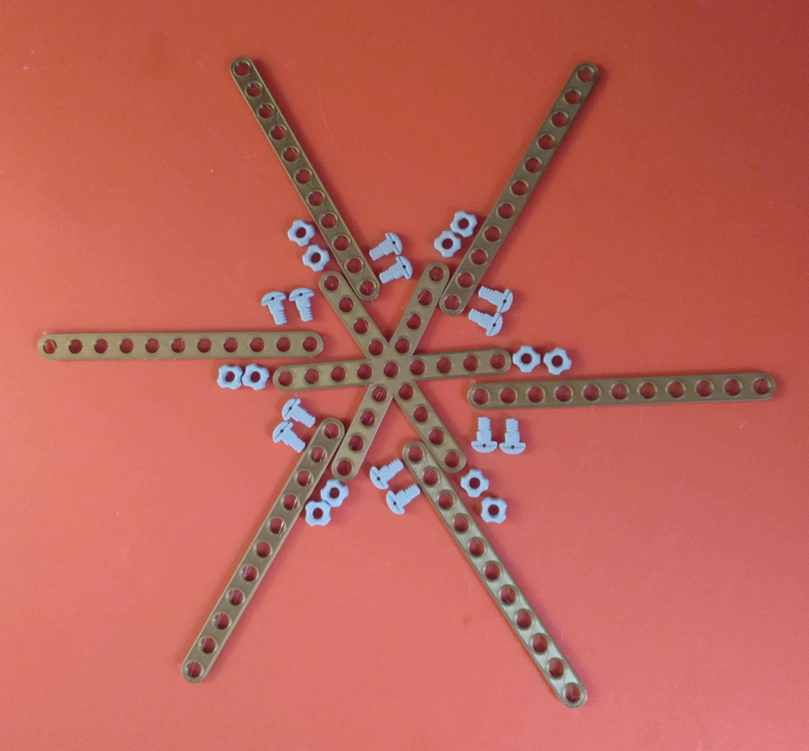
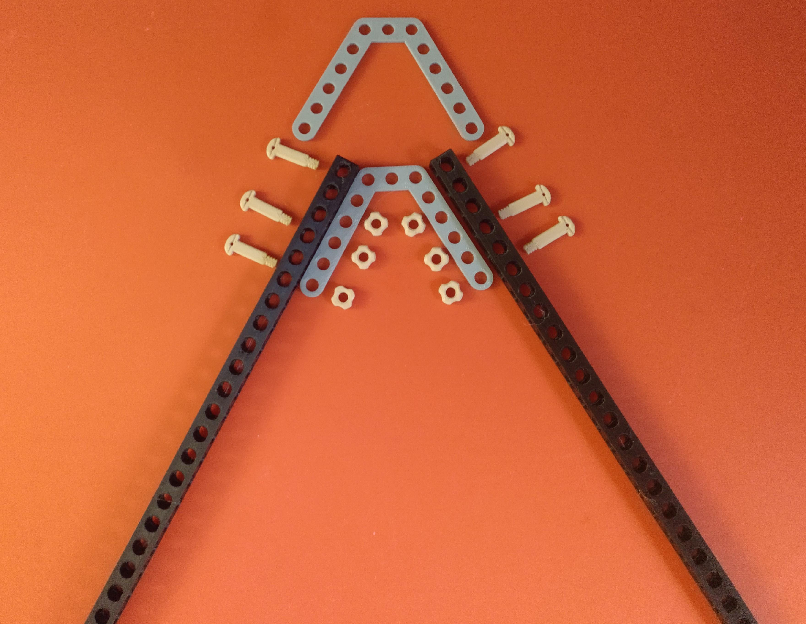

# Carrousel-Stemfie  

Realitzada per [Jordi Mayné](https://github.com/maynej) des de Mechatronic Study 

STEMFIE es un projecte de construcció lliure, que s'imprimeix en 3D (http://stemfie.org) 

Electronics Stemfie es una llibreria STL de suports per tarjes de control, sensors i actuadors amb compatibilitat Stemfie.

[Electronics Suports amb compatibilitat Stemfie](https://github.com/maynej/Electronics-Stemfie), pretén facilitar l'automatització de les construccions amb targes Arduino, Microbit, ESP... 

Tota la [documentació es pot trobar en PDF](https://github.com/maynej/Carrousel-Stemfie/tree/main/Doc).

STL per imprimir la Cabina [aquí](https://github.com/maynej/Carrousel-Stemfie/tree/main/STL/Cabin)

STL per imprimir la Roda [aquí](https://github.com/maynej/Carrousel-Stemfie/tree/main/STL/Wheel)

STL per imprimir la Base [aquí](https://github.com/maynej/Carrousel-Stemfie/tree/main/STL/Base)

## Cabina 

  
Descripció         | Imatge          | Arxiu         
------------- | ------------- | ------------- 
Tensor 7 | | [Tensor 7](STL/Brace7-SPN-BRC-0006_x12.stl)
Marc Cabina | | [Marc Cabina](STL/STR_STD_BRT_AZ_5x5x5_x12.stl)
Femella | | [Femella](STL/NutRH-BU01.00x5mm_x144.stl)
Cargol BU00.50 | | [Cargol BU00.50](STL/ScrewRHD-RH-BU00.50_x96.stl)
Cargol BU00.75 | | [Cargol BU00.75](STL/Screw-RHD-RH-BU00.75_x32.stl)
Escaire | | [Escaire](STL/STR_STD_BRD_AY-1x1_90_x60.stl)
Seient | | [Seient](STL/STR_STD_BRT-AYx1x3x1_x12.stl)
Placa 3x3 | | [Escaire](STL/STR_STD_BRM_3x3_x12.stl)
Placa 3x5 | | [Escaire](STL/STR_STD_BRM_5x3_x12.stl)
Placa 3x7 | | [Escaire](STL/STR_STD_BRM_7x3_x12.stl)
Volandera 5mm | | [Volandera 5mm](STL/Washer-FRE-BU01.00x00.25_x24.stl)

## Roda 

Descripció         | Imatge          | Arxiu         
------------- | ------------- | ------------- 
Tensor 11 | | [Tensor 11](STL/Brace_11-STR-ERR_x24.stl)
Biga 6 | | [Biga 6](STL/beam1x1x6_3.stl)
Creu 9x9x9 | | [Creu](STL/Cross_9x9x9_x2.stl)
Femella | | [Femella](STL/Nut_RH_BU01.00x5mm_x39.stl)
Cargol BU00.50 | | [Cargol BU00.50](STL/Screw_RHD_RH_BU00.50_x24.stl)
Cargol BU00.75 | | [Cargol BU00.75](STL/Screw_RHD_RH_BU00.75_x12.stl)
Cargol BU06.50 | | [Cargol BU06.50](STL/Screw_RHD_RH_BU06.50_x3.stl)
Pin | | [Pin BU07.00](STL/Pin_CL_RHD_BU07.00_x6.stl)
Volandera 12mm | | [Volandera 12 mm](STL/Washer10mm_12.stl)

## Base 

Descripció         | Imatge          | Arxiu         
------------- | ------------- | ------------- 
Tensor 7 | | [Tensor 7](STL/Brace7-SPN-BRC-0006_x12.stl)
Femella | | [Femella](STL/NutRH-BU01.00x5mm_x144.stl)
Cargol BU00.50 | | [Cargol BU00.50](STL/ShoulderScrewRHD_RH_BU00.50-SPN-SSC-0042.stl)
Cargol BU00.75 | | [Cargol BU00.75](STL/ShoulderScrewRHD_RH_BU00.75-SPN-SSC-0043.stl)
Volandera | | [Volandera](STL/Washer-FRE-BU01.00x00.25_x24.stl)

## Llicència

Creative Commons Attribution-NoComercial-ShareAlike 4.0 International (CC BY-NC-SA 4.0)  
