# Carrousel Stemfie  

Realitzada per [Jordi Mayné](https://github.com/maynej) des de Mechatronic Study 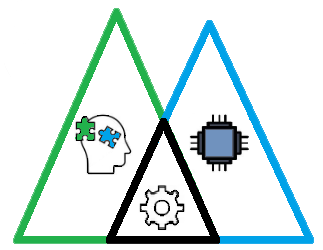

STEMFIE es un projecte de construcció lliure, que s'imprimeix en 3D (http://stemfie.org) 

Electronics Stemfie es una llibreria STL de suports per tarjes de control, sensors i actuadors amb compatibilitat Stemfie.

[Electronics Suports amb compatibilitat Stemfie](https://github.com/maynej/Electronics-Stemfie), pretén facilitar l'automatització de les construccions amb targes Arduino, Microbit, ESP... 

Tota la [documentació es pot trobar en PDF](https://github.com/maynej/Carrousel-Stemfie/tree/main/Doc).

STL per imprimir la Cabina [aquí](https://github.com/maynej/Carrousel-Stemfie/tree/main/STL/Cabin)

STL per imprimir la Roda [aquí](https://github.com/maynej/Carrousel-Stemfie/tree/main/STL/Wheel)

STL per imprimir la Base [aquí](https://github.com/maynej/Carrousel-Stemfie/tree/main/STL/Base)

## Cabina 

  
Descripció    | Quantitat     | Imatge          | Arxiu         
------------- | ------------- | --------------- | -----
Tensor 7 | 12  |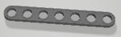 | [Tensor 7](STL/Cabin/Brace_7-SPN-BRC-0006_x12.stl)
Marc Cabina | 12 |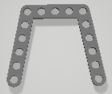 | [Marc Cabina](STL/Cabin/STR_STD_BRT_AZ_5x5x5_x12.stl)
Femella | 144 |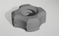 | [Femella](STL/Cabin/NutRH-BU01.00x5mm_x144.stl)
Cargol BU00.50 | 96 |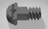 | [Cargol BU00.50](STL/Cabin/ScrewRHD-RH-BU00.50_x96.stl)
Cargol BU00.75 | 48 |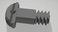 | [Cargol BU00.75](STL/Cabin/Screw-RHD-RH-BU00.75_x32.stl)
Escaire | 60 |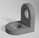 | [Escaire](STL/Cabin/STR_STD_BRD_AY-1x1_90_x60.stl)
Seient | 12 |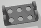 | [Seient](STL/Cabin/STR_STD_BRT-AYx1x3x1_x12.stl)
Placa 3x3 | 12 |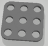 | [Placa 3x3](STL/Cabin/STR_STD_BRM_3x3_x12.stl)
Placa 3x5 | 6 | | [Placa 3x5](STL/Cabin/STR_STD_BRM_5x3_x6.stl)
Placa 3x7 | 6 |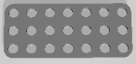 | [Placa 3x7](STL/Cabin/STR_STD_BRM_7x3_x6.stl)
Volandera 5mm | 24 |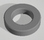 | [Volandera 5mm](STL/Cabin/Washer-FRE-BU01.00x00.25_x24.stl)

## Roda 

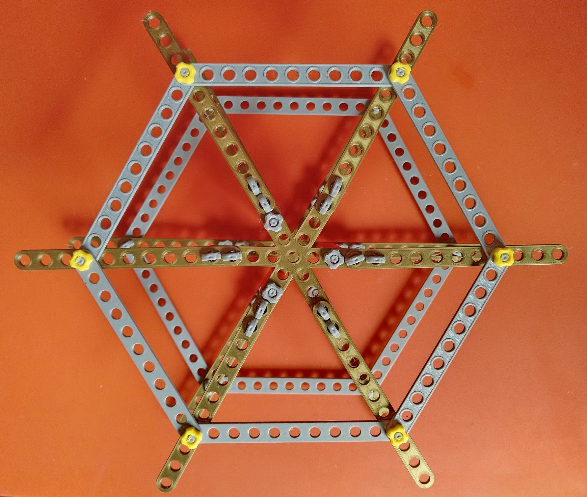

Descripció    | Quantitat     | Imatge          | Arxiu         
------------- | ------------- | --------------- | ----- 
Tensor 11 | 24  |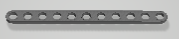 | [Tensor 11](STL/Wheel/Brace_11_STR_ERR_x24.stl)
Biga 6 | 3 |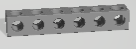 | [Biga 6](STL/Wheel/beam1x1x6_3.stl)
Creu 9x9x9 | 2  |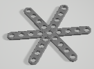 | [Creu](STL/Wheel/Cross_9x9x9_x2.stl)
Femella | 63 | | [Femella](STL/Wheel/Nut_RH_BU01.00x5mm_x39.stl)
Cargol BU00.50 | 24  | | [Cargol BU00.50](STL/Wheel/Screw_RHD_RH_BU00.50_x24.stl)
Cargol BU00.75 | 12  | | [Cargol BU00.75](STL/Wheel/Screw_RHD_RH_BU00.75_x12.stl)
Cargol BU06.50 | 3   |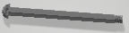 | [Cargol BU06.50](STL/Wheel/Screw_RHD_RH_BU06.50_x3.stl)
Pin | 6  |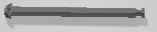 | [Pin BU07.00](STL/Wheel/Pin_CL_RHD_BU07.00_x6.stl)
Fixador | 6  |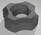 | [Fixador](STL/Wheel/Nut_PH_CL_BU1x5mm.stl)
Volandera 10mm | 12  |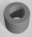 | [Volandera 12 mm](STL/Wheel/Washer10mm_12.stl)

## Base 

Descripció    | Quantitat     | Imatge          | Arxiu         
------------- | ------------- | --------------- | ----- 
Biga 12 | 8 |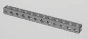 | [Biga 12](STL/Base/Beam_12_x8.stl)
Tensor 4 | 10  |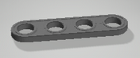 | [Tensor 4](STL/Base/Brace_4_STR_ERR_BU04x01x00.25_x10.stl)
Tensor 12 | 4  |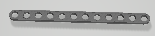 | [Tensor 12](STL/Base/Brace_12_STR_ERR_BU12x01x00.25x4.stl)
Tensor 13 | 4  |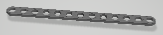 | [Tensor 13](STL/Base/Brace_13_STR_ERR_BU13x01x00.25_x4.stl)
Femella | 44 | | [Femella](STL/Base/Nut_RH_BU01.00x5mm_x44.stl)
Cargol BU00.50 | 8  | | [Cargol BU00.50](STL/Base/Screw_RHD_RH_BU00.50_x8.stl)
Cargol BU01.25 | 12 |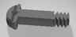 | [Cargol BU01.25](STL/Base/Screw_RHD_RH_BU01.25_x12.stl)
Cargol BU01.50 | 16 |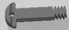 | [Cargol BU01.50](STL/Base/Screw_RHD_RH_BU01.50_x16.stl)
Pin | 1  |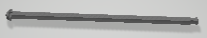 | [Pin Eix](STL/Base/Pin166.stl)
Fixador | 1  | | [Fixador](STL/Base/Nut_PH_CL_BU1x5mm_x1.stl)
U | 4 |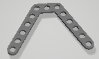 | [U](STL/Base/STR_STD_BRT_AZ_3_5_5_120_x4.stl)
Volandera | 13  | | [Volandera](STL/Base/Washer_FRE_BU01.00x00.25_x13.stl)

## Mesurador Stemfie 

## Llicència

Creative Commons Attribution-NoComercial-ShareAlike 4.0 International (CC BY-NC-SA 4.0)  
